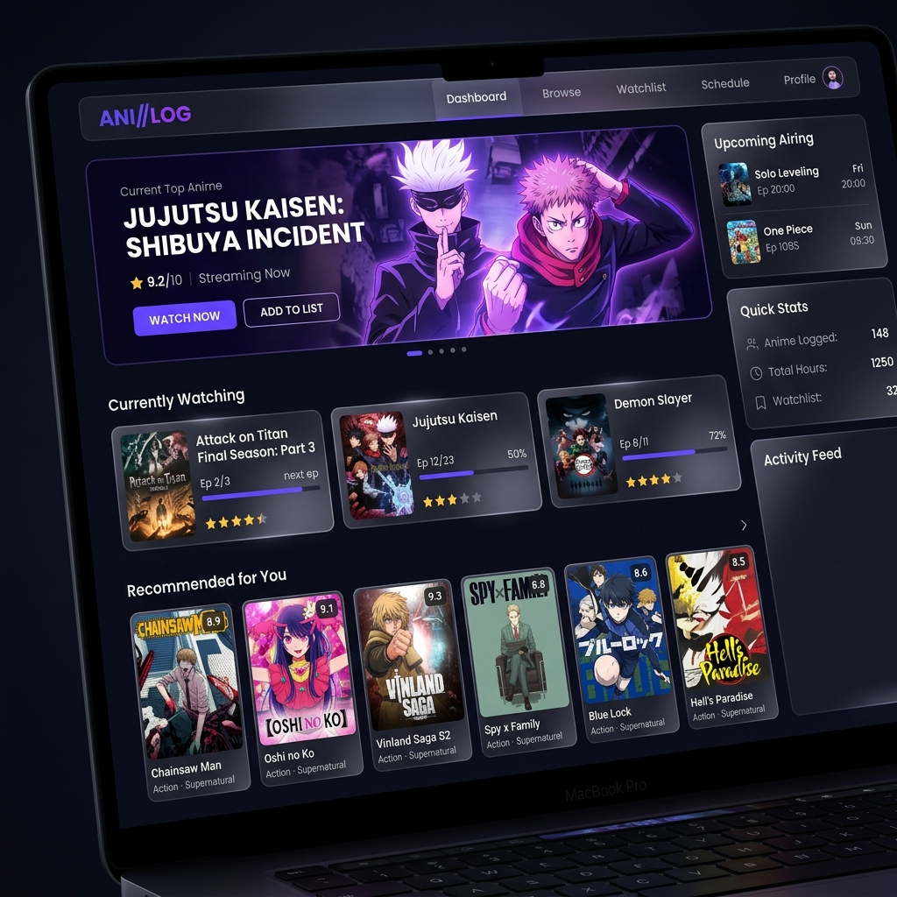
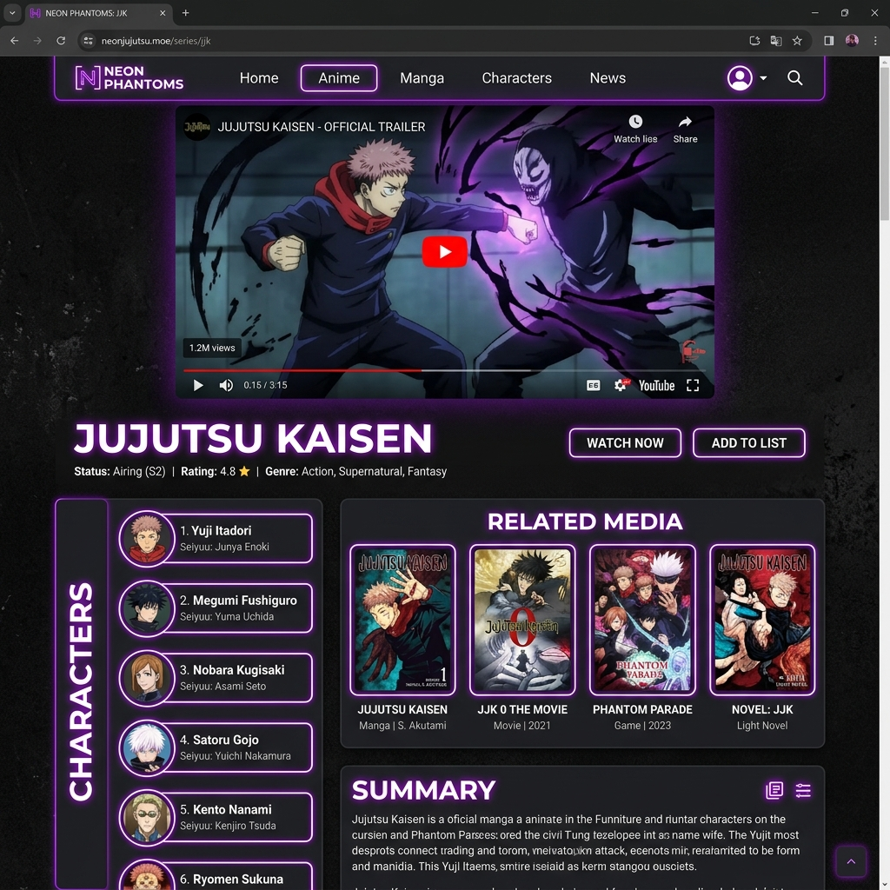
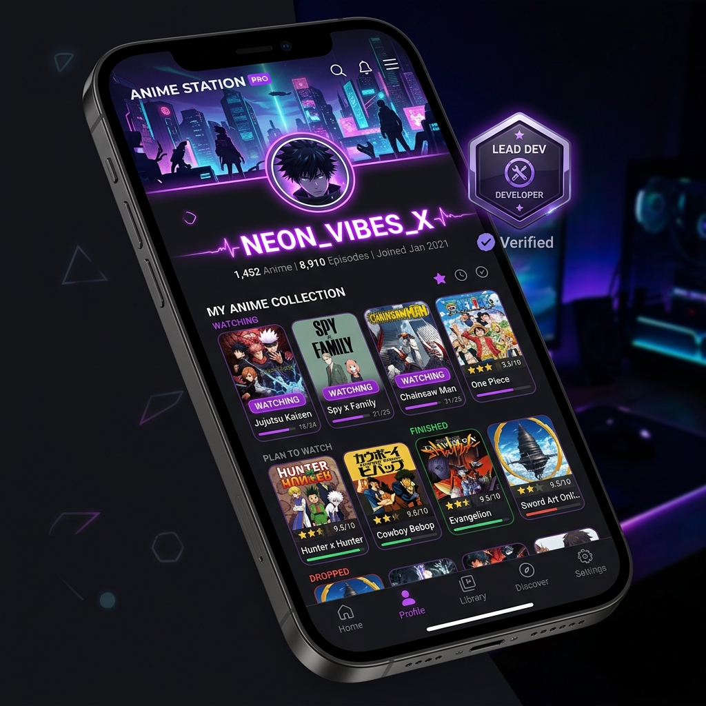

  
   
  <h1>Da Vinci Anime Tracker</h1>
  
A clean, modern, and legally compliant anime information tracker built with Next.js, TypeScript, and Tailwind CSS. It focuses entirely on discovery, scheduling, and personal status tracking.

---

## 🌟 Key Features

- **Live AniList GraphQL Data**: Fetches highly accurate metadata directly from the official AniList API.
- **Airing Calendar**: Tracks exact airing times and countdowns for currently releasing seasonal anime.
- **Local Storage & Cloud Sync**: Keeps track of your personal lists (Interested, Watching, Waiting, Finished, Dropped) seamlessly.
- **Cinematic UI**: Netflix-inspired dark mode UI with glassmorphism, horizontal smooth-scroll carousels, and dynamic badging.
- **Interactive Social Tracking**: Follow your friends, get notified when they follow back via our real-time notification bell!
- **Advanced Search**: Utilizes GraphQL search queries to filter by Status, Season, and Title.

---

## 📸 Platform Highlights

### 1. Dashboard Interface
A sleek, premium dark-mode web application dashboard. Featuring cinematic hero banners, glowing indigo accents, and interactive grids of anime posters.

### 2. Deep Anime Integration
Detailed pages showcasing specific anime. Features embedded YouTube trailers, comprehensive character lists, and related media cards.

### 3. Developer & Social Profiles
Rich user profiles featuring personalized banners, avatars, follow trackers, and exclusive glowing neon badges for lead developers.

---

## ⚠️ Important Note
This application **does not stream anime**. It is an educational tool demonstrating how to build a high-quality frontend tracker using Next.js caching (`next: { revalidate: 3600 }`) and external GraphQL endpoints legally. There are no video players, and no third-party websites are scraped.

## 🛠 Tech Stack
- Next.js (App Router, Server Components)
- React 19
- TypeScript
- Tailwind CSS 4
- Framer Motion (Micro-animations)
- Lucide React (Icons)
- PostgreSQL (Prisma ORM)
- AniList API v2

## 🚀 Getting Started

1. Clone the repository.
2. Run `npm install`.
3. Run `npm run dev`.
4. Open [http://localhost:3000](http://localhost:3000) to view the application.
